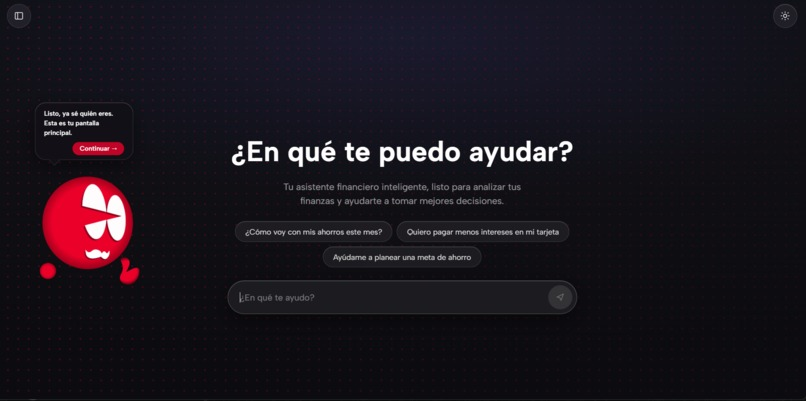
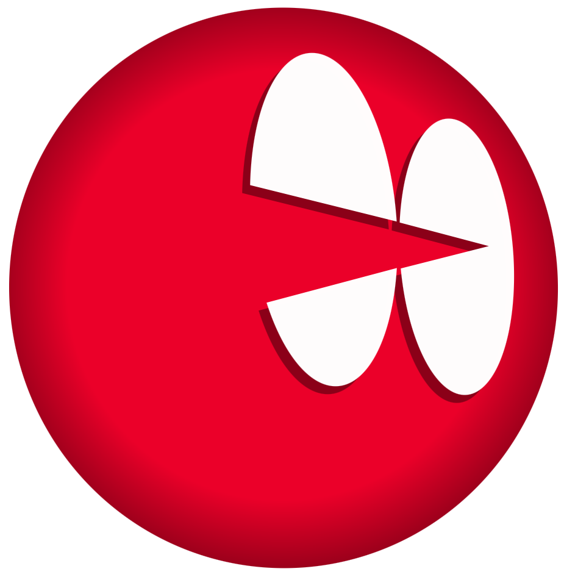
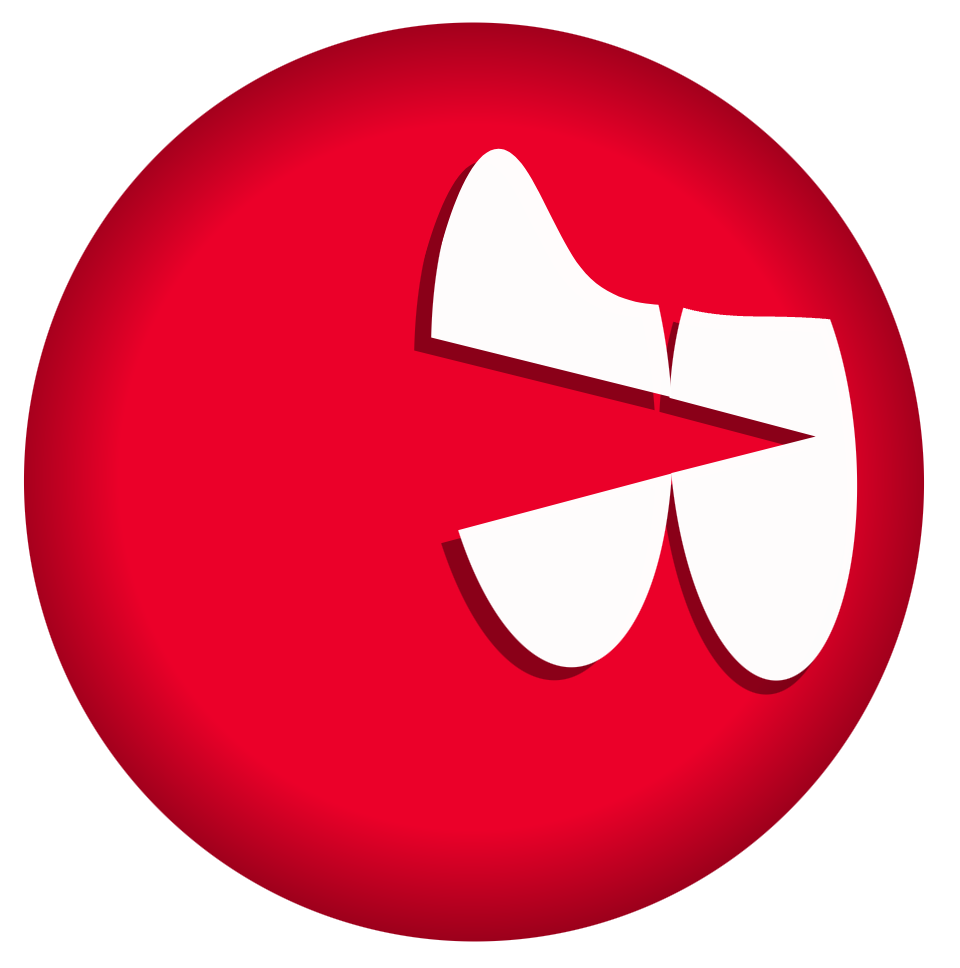
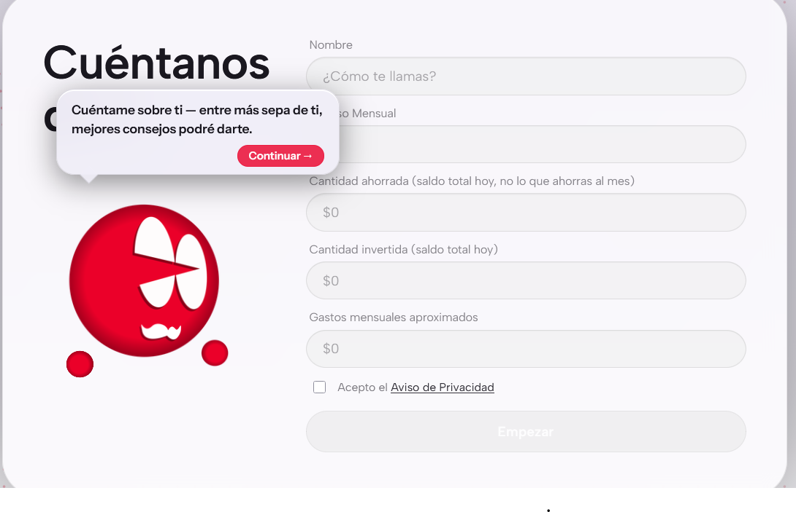
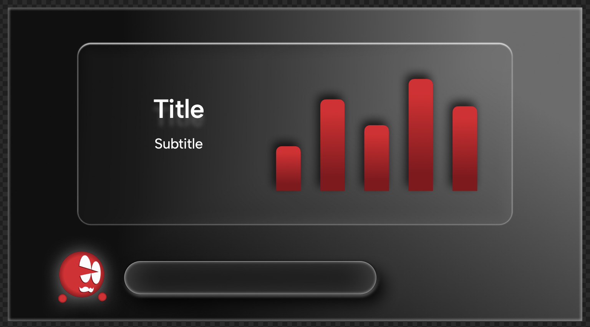

# Banky — asistente financiero donde el agente construye la interfaz

Finalista del reto Banorte en HackMTY 2026. El agente no responde con texto:
llama herramientas reales y **compone la pantalla** que las explica.

<p align="center">
  
</p>

```
Usuario ──▶ Agente (LLM) ──▶ Herramientas (datos) ──▶ A2UI ──▶ Componentes
   ▲                                                              │
   └──────────── la interacción regresa como contexto ─────────────┘
```

**[Ver demo](https://www.banky.mx)** — corre entera en el navegador, sin backend.

---

## Qué hace distinto

Casi cualquier asistente financiero te contesta con un párrafo. Este decide
**qué forma tiene la respuesta**: si conviene una curva, una comparación lado a
lado, un anillo de avance o una tabla, y arma esa pantalla con un catálogo de
19 componentes propios.

El modelo no dibuja: emite un plan A2UI que un validador acepta o rechaza
contra el catálogo. Si el plan no valida, se repara con los errores del
validador y, si aun así falla, cae a una pantalla de respaldo. **Nunca se
renderiza HTML del modelo.**

Las herramientas las ejecuta el harness, no el modelo — así la traza de qué se
consultó y con qué argumentos sigue siendo auditable, sin importar qué
proveedor esté detrás.

## Banky, la mascota

<p align="center">
  
  
  
</p>

Narra lo que está pasando mientras el agente trabaja — qué herramienta está
consultando, cuándo terminó, qué señala el cursor — y cambia de gesto según el
contexto: se pone pensativo mientras razona y preocupado si detecta números en
rojo en tu pantalla. Es la cara visible de la traza.

<p align="center">
  
</p>

---

## Dos targets, un repo

| | `web/` | `legacy/` |
|---|---|---|
| Qué es | La demo permanente | El proyecto del hackatón |
| Dónde corre | GitHub Pages (CDN) | Tu máquina o un contenedor |
| Backend | Ninguno | FastAPI + MCP por stdio |
| Proveedor | Lo elige quien visita | Flag de despliegue (`LLM_PROVIDER`) |
| Estado | Activo | **Congelado** — no se toca |

`legacy/` es el respaldo íntegro de lo que corrió en la demo en vivo: harness,
servidor MCP, frontend, 94 tests, Docker. Tiene su propio README y su propio
Makefile. No se borra ni se degrada.

**Regla dura:** `web/` no importa nada de `legacy/` en runtime. Lo único que
cruza son artefactos generados en build (ver *Contrato compartido*).

---

## Los dos links

| URL | Vigencia |
|---|---|
| `https://www.banky.mx` | **hasta ~sep-2027** — el dominio no se renueva |
| `https://luisxavierxd.github.io/HackMTY-2026_Banorte/` | permanente |

El canónico es **`www`**: es lo que dice `web/public/CNAME`, y GitHub Pages
sirve desde ahí. El apex (`banky.mx` pelón) redirige a `www` siempre que sus
registros `A` apunten a las IPs de Pages.

Mientras el custom domain esté activo, Pages también **redirige** el link de
`github.io` hacia el dominio. O sea que hay un solo link vivo a la vez, y
cuando el dominio venza el de respaldo tampoco responde hasta quitar el CNAME
a mano. Por eso el ancla visible en portafolio y Devpost dice "ver demo", no el
dominio: cambiar el `href` no obliga a reescribir el texto.

<details>
<summary><b>DNS</b></summary>

| Registro | Nombre | Valor |
|---|---|---|
| `CNAME` | `www` | `luisxavierxd.github.io` |
| `A` | `@` | `185.199.108.153` |
| `A` | `@` | `185.199.109.153` |
| `A` | `@` | `185.199.110.153` |
| `A` | `@` | `185.199.111.153` |

Los cuatro `A` del apex son los que hacen que `banky.mx` sin `www` también
resuelva y redirija. Sin ellos solo funciona `www`.

</details>

<details>
<summary><b>Procedimiento cuando venza el dominio</b></summary>

1. Borrar `web/public/CNAME` y quitar el custom domain en Settings → Pages.
2. Re-desplegar con `VITE_BASE=/HackMTY-2026_Banorte/`.
3. Actualizar el `href` en README, Devpost y portafolio.

</details>

---

## Correr la demo

```bash
make web-install      # cd web && npm ci
make web-dev          # http://localhost:5173
```

Al entrar eliges con qué correrla:

| Opción | Pide | Qué hace |
|---|---|---|
| **Ver sesión grabada** | nada | Respuestas pregrabadas con el harness real |
| **Anthropic** | API key | Ciclo completo en tu pestaña |
| **Gemini** | API key | Igual; Google AI Studio tiene tier gratuito |
| **CLI local** | URL + código | Se conecta al harness de `legacy/` corriendo en tu máquina |

Para *CLI local* puedes usar cualquiera de los cuatro agentes; el gate te da el
comando según cuál elijas:

| CLI | Binario | Comando | Credencial |
|---|---|---|---|
| Claude Code | `claude` | `make demo-code` | tu suscripción |
| Codex | `codex` | `make demo-codex` | login de ChatGPT |
| Cursor | `cursor-agent` | `make demo-cursor` | `CURSOR_API_KEY` |
| Antigravity | `agy` | `make demo-agy` | tu cuenta de Google |

Para el navegador los cuatro son idénticos: se conecta al mismo WebSocket. Lo
único que cambia es qué perfil corre el harness del otro lado.

La sesión grabada va primero y preseleccionada: quien llega sin key tiene que
ver algo funcionando en un clic. **Las API keys nunca se guardan** — viven en
`sessionStorage` y se van al cerrar la pestaña. El proveedor elegido sí se
recuerda.

El navegador no puede ejecutar un CLI: para la opción *CLI local* corres el
harness en tu máquina y esta página se conecta por WebSocket.

```bash
cd legacy && make demo-code     # luego pon ws://127.0.0.1:8080 en el gate
```

> Los perfiles `codex` y `cursor` se agregaron después del hackatón y sus flags
> salieron de documentación oficial, no de correr los binarios. Si alguno falla,
> el error trae el `argv` completo y se corrige con `CLI_BINARY` /
> `CLI_EXTRA_ARGS` sin tocar código.

> Usa `127.0.0.1`, no `localhost`: Chrome bloquea `ws://localhost` desde una
> página HTTPS como mixed content, y la IP de loopback sí pasa.

---

## Cómo funciona un turno

Un turno tiene **dos fases**, y separarlas es la decisión de diseño central:
razonar qué datos hacen falta, y después decidir qué forma tiene la pantalla.

```
                 ┌─────────────── FASE 1: razonar ───────────────┐
tu mensaje ──▶ LLM ──▶ ¿qué herramienta? ──▶ el HARNESS la ejecuta
                 ▲                                    │
                 └──────── resultado como contexto ◀───┘   (hasta 6 vueltas)
                                                      │
                 ┌─────────────── FASE 2: componer ──┴────────────┐
                 LLM ──▶ plan de UI ──▶ validador ──▶ envelopes A2UI ──▶ render
                                           │
                                    ¿no valida? ──▶ reparar (1 intento) ──▶ fallback
```

**Las herramientas las ejecuta el harness, nunca el modelo.** El modelo decide
*cuál* llamar y con qué argumentos; ejecutarla es del harness, contra sus
propios servidores MCP. Esa frontera es lo que mantiene la traza auditable y
comparable entre proveedores — con un CLI agéntico sería fácil delegarle
también la ejecución, y a propósito no se hace (`CLI_DELEGATE_MCP=0`).

### El modelo no emite protocolo

Emite un **plan compacto** en JSON:

```json
{
  "title": "Por qué el CAT es más alto que la tasa",
  "summary": "una línea para el chat",
  "root": "root",
  "components": [
    {"id": "root", "component": "Column", "props": {"children": ["kpi", "desglose"]}},
    {"id": "kpi",  "component": "MetricCard",
     "props": {"label": "CAT", "value": {"path": "/datos/explicar_cat/resumen/cat_aproximado"}}}
  ]
}
```

Python lo valida contra el catálogo, resuelve los bindings y lo traduce a
envelopes A2UI v0.9.1 (`createSurface` → `updateDataModel` → `updateComponents`).
Eso compra tres cosas:

- Una alucinación de componente **no rompe el render**: se poda y se reporta.
- El protocolo puede migrar sin tocar el prompt.
- El composer es determinista y se testea sin llamar al modelo.

Si el plan no valida, se reintenta **una vez** pasándole los errores del
validador; si aun así falla, cae a una pantalla de respaldo. **Nunca se
renderiza HTML del modelo.**

### Bindings, no números copiados

Los componentes no traen los datos dentro: apuntan con JSON Pointer a un *data
model* donde el harness ya inyectó los resultados reales de las herramientas
(`{"path": "/datos/explicar_cat/serie"}`). Así una serie de 600 puntos viaja
una sola vez y el modelo no puede "inventar" un número que contradiga a la
herramienta que lo calculó.

Cuando tocas un `Slider` o un `ActionButton`, ese estado regresa al agente como
contexto (`[EVENTO_UI]`) y el ciclo vuelve a empezar. Eso es lo que cierra el
lazo del diagrama de arriba.

## El catálogo: una fuente, tres consumidores

`a2ui/catalog.py` define 19 componentes con sus props tipadas, y es lo único
que comparten:

| Consumidor | Qué saca de ahí |
|---|---|
| El **prompt** del agente | qué puede pedir (versión compacta, para ahorrar tokens) |
| El **validador** | qué se acepta, con qué tipos y defaults |
| El **frontend** | qué sabe renderizar |

Si los tres no salieran del mismo lugar, el modelo pediría componentes que el
front no conoce. Por eso el catálogo viaja como artefacto generado al target
navegador (ver *Contrato compartido*, abajo) en vez de copiarse a mano.

## MCP: el harness es multi-servidor

`mcpx/manager.py` mantiene N servidores MCP vivos durante toda la vida del
proceso — no por request, que es la causa #1 de demos lentas. Soporta los dos
transportes que importan: **stdio** para local y **streamable-http** para
contenedores.

Las herramientas se namespacean `servidor__herramienta`, así montar seis
dominios a la vez no colisiona (`credito__simular_plan` vs
`banca__simular_plan`). Un servidor caído **no tumba el harness**: se registra
el fallo y el resto sigue.

Agregar un dominio son dos pasos y cero cambios en el core:

```bash
# 1. mcp_servers/<dominio>/server.py con sus @mcp.tool()
# 2. registrarlo en mcp_servers.json  (o dejar el stdio por defecto)
```

El dominio incluido, `educacion_financiera`, expone 6 herramientas de consulta
—interés compuesto, pago mínimo vs. fijo, meta de ahorro, CAT, inflación,
regla 50/30/20— y cada una devuelve **la serie completa**, no solo el número
final, para que el front pueda animar la curva en vez de pintar un dato suelto.

## El proveedor es una capa, no un `if`

Todo el ciclo habla tipos neutrales (`ToolSpec`, `ToolCall`, `Completion`) y
consulta **una sola capacidad**: `native_tools`.

```
native_tools = True   → el proveedor devuelve tool_calls estructurados
native_tools = False  → el manifiesto va en el system prompt y el ciclo
                        parsea {"tool_calls": [...]} del texto
```

En los dos casos las ejecuta el harness. Por eso los ocho perfiles producen
trazas comparables: mismo MCP, mismo catálogo, mismo validador, mismos
envelopes.

| Perfil | Motor | Requiere |
|---|---|---|
| `gemini` | Gemini API | `GOOGLE_API_KEY` |
| `anthropic` | Anthropic Messages API | `ANTHROPIC_API_KEY` |
| `claude_code` | CLI `claude` headless | suscripción local |
| `codex` | CLI `codex exec` headless | login de ChatGPT |
| `cursor` | CLI `cursor-agent` headless | `CURSOR_API_KEY` |
| `antigravity` | CLI `agy` headless | cuenta de Google |
| `hybrid` | razona con API, **compone con el CLI** | la del razonador |
| `fake` | sin modelo; MCP y A2UI reales | nada |

`hybrid` existe porque las dos fases no tienen que correr en el mismo motor:
se puede razonar con un modelo caro y componer la UI con uno barato, o al
revés. `fake` corre el ciclo completo sin tocar la red — es lo que hace que
los 107 tests pasen en CI sin credenciales.

Los CLIs agénticos existen por una razón práctica de hackatón: quedarse sin
cuota o sin red a media demo. Corren headless y el harness sigue ejecutando el
MCP.

---

## Contrato compartido

El Python manda; el navegador consume artefactos generados. Nada se copia a
mano entre los dos targets.

```bash
make contract         # regenera desde el harness de legacy/
make contract-check   # falla si lo commiteado quedó viejo (esto corre en CI)
```

Emite `web/public/contract/` (catálogo de 19 componentes, 6 herramientas y sus
esquemas) y `web/tests/goldens/` (28 casos entrada→salida calculados por el
Python, con bordes: cero, plazos largos, tasas absurdas).

Dos mecanismos impiden que las implementaciones se separen:

1. **CI regenera y compara.** Si hay diferencia, el build falla pidiendo
   `make contract`.
2. **`make web-test`** corre cada golden contra la implementación TS de la
   herramienta, con tolerancia relativa `1e-9` — nunca igualdad de floats.

Sin estos dos, las dos versiones del dominio dicen cosas distintas en semanas.
Son la razón por la que duplicar el ciclo es aceptable.

---

## Estructura

```
web/                      demo permanente (GitHub Pages)
  public/contract/          GENERADO — catálogo, herramientas, esquemas, prompts
  public/recorded/          GENERADO — sesiones grabadas del harness real
  src/engine/               TurnEngine: recorded | browser | remote
  src/provider/             adaptadores Anthropic y Gemini
  src/agent/                ciclo, prompts, composer y las 6 tools en TS
  src/a2ui/                 renderer de componentes + gráficas ECharts
  src/shell/                gate de proveedor, sidebar, composer, mascota
  tests/goldens/            GENERADO — paridad numérica con el Python

scripts/                  exportadores del contrato (build, nunca runtime)

legacy/                   el proyecto del hackatón, congelado
  src/harness/
    a2ui/                   catálogo (19 componentes), validador, composer,
                            envelopes v0.9.1, JSON Pointer
    agent/                  ciclo agnóstico de proveedor + prompts
    providers/              gemini · anthropic · cli_agent · fake
    mcpx/                   cliente multi-servidor MCP + sanitizador de esquemas
    session/                estado por sesión (memoria | Redis)
    auth.py                 código de acceso (protege cuota en demo pública)
    app.py                  FastAPI: WS, SSE, catálogo, health
  mcp_servers/
    educacion_financiera/   6 herramientas de consulta, series completas
    common/                 almacén sintético persistente
  frontend/                 el front original del hackatón
  tests/                    107 tests, sin red
```

### La superficie HTTP del harness

| Método | Ruta | Para qué |
|---|---|---|
| `GET` | `/healthz` · `/readyz` | liveness; `readyz` reporta cada MCP y el proveedor activo |
| `GET` | `/a2ui/catalog.json` | el catálogo — el front lo lee al arrancar |
| `GET` | `/a2ui/tools` | herramientas montadas, para la demo técnica |
| `WS` | `/ws/{session_id}` | canal principal, bidireccional |
| `POST` | `/v1/turn` | el mismo ciclo por SSE (curl, serverless) |
| `DELETE` | `/v1/session/{id}` | reinicia la conversación |

Los eventos que salen del turno son los mismos por WS y por SSE:
`tool_call` · `tool_result` · `thinking` · `surface` · `turn_end` · `error`.
Ese contrato es exactamente el que implementan los tres motores del navegador
— por eso meter Pyodide después no tocaría una línea de UI.

## El diseño

<p align="center">
  
</p>

Estudio original del bento — de ahí salieron el vidrio esmerilado, el rojo
Banorte sobre fondo oscuro y la regla de una idea por tarjeta. El layout se
adapta al número de tarjetas que mande el agente (1, 2, 3 o 4+), y cuando
reparte gráficas en dos filas las comprime para que todo quepa sin que el
dashboard crezca.

## Stack

**web/** React 19 · Vite · TypeScript · ECharts · CSS propio (sin framework) ·
diseño liquid glass · mascota SVG animada.

**legacy/** Python 3.11+ · FastAPI · MCP · A2UI v0.9.1 · Docker.

Los datos son **sintéticos**. Esto no es asesoría financiera.
